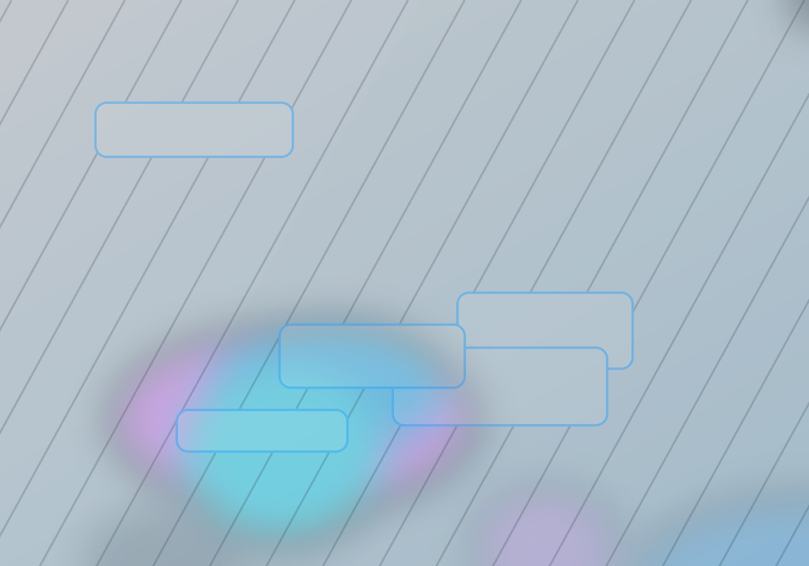

Sometimes an article is built around a sequence of images: interface sketches, cover variations, screenshots before and after a change. For that kind of note, it is convenient to keep images right next to the Markdown file.

This format is called a page bundle. Hugo sees not only `index.md`, but also the files beside it, so it can detect image dimensions and prepare a proper gallery.

## Syntax

In Markdown, it looks almost like regular images:

```markdown
 
```

## Result

 

## How to Use It

For design notes, it is useful to keep several versions of the same idea together. The first file can be a calm base composition, while the second one can be a more contrast-heavy card cover. In the article, both versions can be compared quickly across light and dark themes.

The simple rule is this: if an image belongs to an article, it should live next to that article. This makes the project easier to move, archive, and publish.
